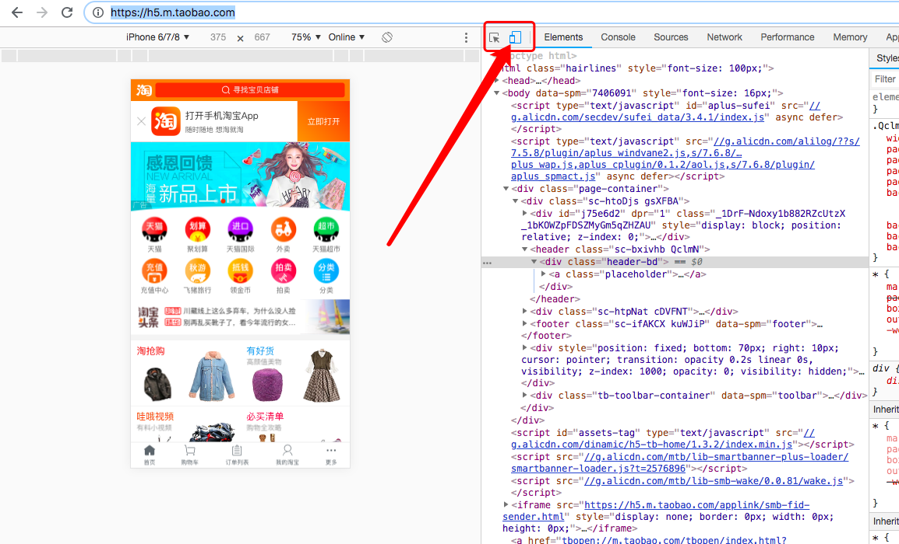
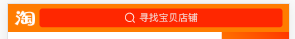

## 手机web学习之淘宝网页

#### 1.创建一个文件index.html

***参照淘宝手机web网站，我们使用google浏览器，`右击`-`检查元素`-`手机模式`链接[点此](https://h5.m.taobao.com/)***



```html
<!DOCTYPE html>
<html lang="zh-cmn-Hans">
<head>
    <meta charset="UTF-8">
    <!-- 手机 -->
    <meta name="viewport" content="width=device-width,initial-scale=1,user-scalable=0">
    <!-- 标题 -->
    <title>淘宝网触屏版</title>
    <!-- 引入css文件 -->
    <link rel="stylesheet" href="./style.css">
</head>
<body>

</body>
</html>
```

#### 2.创建一个css文件style.css

```css
body {
    font-family: '微软雅黑'; /** 设置字体库 */
}

* {
    margin:0;
    padding:0;
}

/** 自定义一些基础样式 */

/** 我们的盒子 */
.web_ui_box {
    display: -webkit-box;
    display: -webkit-flex;
    display: flex;
}

/** 让盒子里的东西上下居中显示 */
.web_ui_box.center {
    -webkit-box-align: center;
    -webkit-align-items: center;
    align-items: center;
}

/** 盒子里的元素撑开填满剩余空间的样式 */
.web_ui_item {
    -webkit-box-flex: 1;
    -webkit-flex: 1;
    flex: 1;
    min-width: 0;
}
```

#### 3.准备好一份淘宝的资源文件

---- 

下面我们开始分析淘宝网站，并着手自己写

----

#### 4.淘宝网页的顶部，也就我们说的header



***【注】这里我们为了这个模块能够浮动在页面最顶端，而不跟随页面滚动而滚动，我们需要使用`CSS`中的`position`，它的参数有 `fixed`,`absolute`,`relative`***

> fixed 会使元素相对于整个窗口浮动

> absolute 会使元素相对于父级元素浮动（这里说的有点片面，absolute一般会relative一起使用，我们一般会在元素的父级加上relative来限制absolute浮动的位置）

> relative 会使元素相对自己所在的位置进行偏移调整，元素不会浮动

- 我们先写html，搭建好架子再写css。分析图片，整个图片就是一个大的盒子，左边装的是一个居中显示`淘`字的图片，右边是一个撑满剩余空间的盒子，中间有文字和一个搜索的icon

```html
<!-- header 盒子 这里就用到我们准备好的盒子样式 -->
<div class="header web_ui_box">
    <!-- 左边的掏字 -->
    

    <!-- 右边撑满的盒子 -->
    
</div>
```